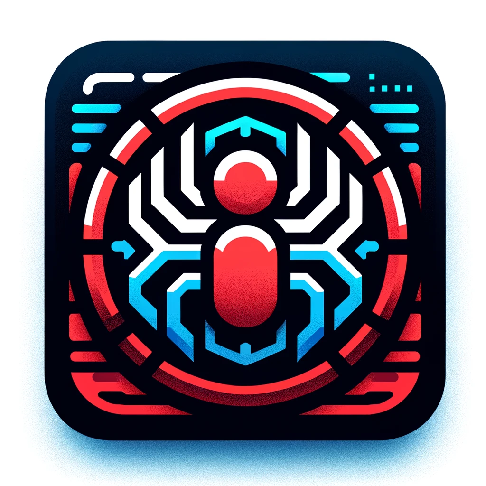

<div align="center">
  
  <h1>Spidey Shell</h1>
  <h3>A terminal-based interface for improving development workflow.</h3>
  <p>Inspired by the Insomniac Spider-man games.</p>
</div>

---

## Overview

Spidey Shell is a terminal user interface (TUI) for managing conversations with multiple OpenAI servers (workspaces). It provides a chat-like interface for sending prompts and receiving replies, supporting history per server, and quick server switching—all from your terminal.

- **Multi-server chat history:** Each server has its own persistent conversation log.
- **OpenAI integration:** Uses the GPT-4o model via async-openai.
- **Clean TUI:** Built with Crossterm and Ratatui for a snappy UX.
- **Quick navigation:** Use keyboard shortcuts to switch servers, compose messages, and send prompts.

---

## Features

- List and switch between multiple servers (workspaces)
- Persistent chat history for each server
- Sends chat history and prompt to OpenAI's GPT-4o model
- Displays assistant response inline
- Keyboard controls for streamlined workflow

---

## Installation

### Prerequisites
- Rust (edition 2021 or newer)
- [OpenAI API key](https://platform.openai.com/account/api-keys)

### Build
```bash
cargo build --release
```

### Run
```bash
OPENAI_API_KEY=your-key-here cargo run --release
```
Or create a `.env` file with:
```
OPENAI_API_KEY=your-key-here
```

---

## Usage

- Launch the app from your terminal.
- The left panel shows available servers. The right panel displays chat history and input.
- **Navigation:**
  - `↑` / `↓`: Select server
  - `q`: Quit
  - `Enter`: Send input (uses selected server)
  - `Backspace`: Edit input
  - Type to compose your prompt
- When 'All' is selected, input is sent to the first available server.

### Server Setup
- Each server must be a subdirectory under `mcp_servers/`. E.g.:
  ```
  mcp_servers/foo/
  mcp_servers/bar/
  ```
- Chat history is saved in `mcp_servers/<server>/history.json`.
- The `All` pseudo-server aggregates messages from all servers (read-only).

---

## Project Structure

- `src/main.rs`: Main TUI logic, event loop, UI rendering, and input handling.
- `src/openai.rs`: Async OpenAI client integration and chat completion handling.
- `src/lib.rs`: Exposes the OpenAI module.
- `Cargo.toml`: Rust project manifest and dependencies.
- `README.md`: This file
- `icon.png`: Project icon

---

## Dependencies

- [async-openai](https://github.com/64bit/async-openai) (OpenAI API)
- [crossterm](https://github.com/crossterm-rs/crossterm) (Terminal events)
- [ratatui](https://github.com/ratatui-org/ratatui) (TUI rendering)
- [tokio](https://tokio.rs/) (Async runtime)
- [serde](https://serde.rs/) & [serde_json](https://docs.serde.rs/serde_json/) (Serialization)
- [dotenv](https://github.com/dotenv-rs/dotenv) (Env loading)

---

## License

MIT License. See [LICENSE](LICENSE) for details.
